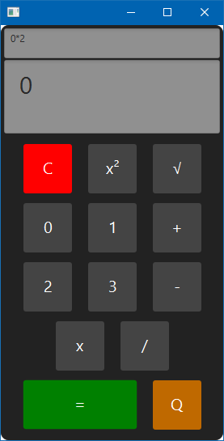
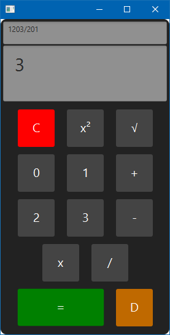
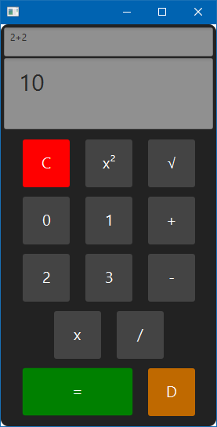

# Quaternary Calculator Group 9

## Project Overview
This project is a calculator designed to perform arithmetic operations on quaternary (base-4) numbers. The calculator supports addition, subtraction, multiplication, division, squaring, and square root of quaternary numbers. It also allows users to toggle the display between quaternary and decimal (base-10) number systems.

## Features
- **Basic Arithmetic Operations:** Supports addition, subtraction, multiplication, division, squaring, and square root of quaternary numbers.
- **Dual Display:** Toggle between quaternary and decimal representations of numbers.
- **User-Friendly Interface:** Designed to resemble a traditional calculator with only four number buttons (0, 1, 2, 3).
- **Separate UI and Logic:** Clean separation between the user interface and the business logic, allowing for maintenance and testing.

## Installation
### Prerequisites
- **Java Development Kit (JDK) 17**
- **IntelliJ IDEA**

### Setup Instructions
1. **Clone the Repository:**
   ```bash
   git clone https://github.com/yourusername/quaternary-calculator.git
   cd quaternary-calculator
   ```

2. **Open in IntelliJ:**
    - Open IntelliJ.
    - Select **Open** and navigate to the cloned repository.
    - IntelliJ will automatically detect and import the project.

3. **Build the Project:**
    - Ensure that the correct JDK (17 or 19) is configured.
    - Build the project using the Build menu or by pressing `Ctrl+F9`.

4. **Run the Application:**
    - Use the `Run` option in IntelliJ IDEA to start the calculator.
    - Ensure that you are running the UI class directly, and not through Gradle.

## Usage
### Basic Operations
1. **Enter a Quaternary Number:** Click on the digits (0, 1, 2, 3) to form a quaternary number.
2. **Select an Operation:** Click on one of the operation buttons (+, -, *, /).
3. **Enter the Second Number:** Enter another quaternary number.
4. **View the Result:** Press the `=` button to display the result.
5. **Toggle Display Mode:** Use the toggle button to switch between quaternary and decimal views.

### Example
- **Operation:** 12 (quaternary) + 21 (quaternary)
- **Result:** The result in quaternary is `33`, which equals `15` in decimal.

## Project Structure
- `.gitignore`: Specifies files and directories to be ignored by Git.
- `README.md`: This documentation file.
- `QuaternaryOperationsTest.java`: Contains unit tests for Quaternary calculations methods.
- `UI.java`: Class that acts as runnable application.
- `UIController.java`: Contains logic and functionality for GUI.

### Branches
- `main`: Original (but outdated) branch. Contains original commits from before swapping to master branch as new main.
- `master`: New main branch for usage of JavaFX. Shows that almost all commits are from Tia Self because she created the new branch.
<!-- add additional information-->

## Team Members and Contributions
- **Jake King**: Set up the project structure and handled Git integration.
- **Tia Self**: Developed UI.
- **Dennis Vo**: Developed logic and testing for Square/Square Root and logic for the Calculator class.
- **Spencer Smith**: Developed logic and testing for Multiplication/Division.
- **Solomon Siang**: Developed logic and testing for Addition/Subtraction.

## Meetings and Discussions
## Meeting 1: 8/30/2024 5:00 PM
- **Medium:** Slack Call
- **Attendees:** Spencer Smith, Solomon Siang, Dennis Vo, Jake King
- **Discussion:** Initial project setup and task distribution.
## Meeting 2: 9/2/2024 12:30 PM
- **Medium:** Slack DMs 
- **Attendees:** Spencer Smith, Solomon Siang, Dennis Vo, Jake King, Tia Self
- **Discussion:** Additional role assignment and project design. 
## Meeting 3: 9/3/2024 12:00 PM
- **Medium:** In-person
- **Attendees:** Spencer Smith, Solomon Siang, Dennis Vo
- **Discussion:** Calculator Class and what was needed before starting the UI.
## Meeting 4: 9/6/2024 4:00 PM
- **Medium:** Slack DMs
- **Attendees:** Spencer Smith, Solomon Siang, Dennis Vo, Tia Self
- **Discussion:** Remaining work load/distribution, individual issues with Gradle, potential of activating Shit Happens
## Meeting 5: 9/8/2024 3:00 PM
- **Medium:** Slack DMs
- **Attendees:** Spencer Smith, Solomon Siang, Dennis Vo, Jake King, Tia Self
- **Discussion:** Finishing touches

<!-- Format for adding meetings below:

## Meeting 1: [Date and Time]
- **Attendees:** [Names of attendees]
- **Medium:** [e.g., Zoom, Slack, in-person]
- **Discussion:** Initial project setup, task distribution, and timelines.

-->

## Testing
- The project includes unit tests for the QuaternaryOperations.
- Run the tests using the built-in testing tools in IntelliJ IDEA.
- Ensure all tests pass before committing to the repository.

## Dependencies
- The project uses standard Java libraries, as well as: 
- JavaFX version 22.0.2 for UI
- JavaJUnit5.8.1, opentest4j-1.2.0.jar, apiguardian-api-1.1.2.jar for testing
<!-- update this with other dependencies if needed-->

## Screenshots



